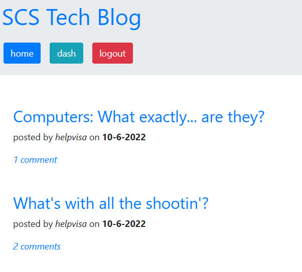
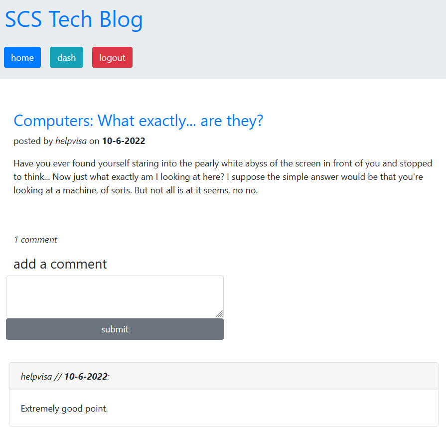

# SCS Tech Blog Server

## Description

A complete server setup (including database storage) that functions as an online blog, allowing users to create and login to accounts to make new posts which display on the homepage for other users to read and comment on.

## Table of Contents
- [Installation](#installation)
- [Usage](#usage)
- [Images](#images)

- [Credits](#credits)

- [License](#license)

## Installation

Navigate to the root directory of the project in your commandline and type 'npm i' in order to install the packages necessary to run the project. If you're running your database locally, it's a good idea to also use the MySQL CLI to initialize the schema.sql file in the db folder.

## Usage

Navigate to the root directory of the project in your commandline and type 'npm start' in order to start your server. Make sure you've created a .env file using the included .env.example as a baseline.

Live deployment available [here on Heroku.](https://helpvisa-scs-techblog.herokuapp.com/)

## Images

## Credits

Created by [Daniel Brackenbury](https://github.com/helpvisa).

## License

Copyright 2022 Daniel Brackenbury

Permission is hereby granted, free of charge, to any person obtaining a copy of this software and associated documentation files (the "Software"), to deal in the Software without restriction, including without limitation the rights to use, copy, modify, merge, publish, distribute, sublicense, and/or sell copies of the Software, and to permit persons to whom the Software is furnished to do so, subject to the following conditions:

The above copyright notice and this permission notice shall be included in all copies or substantial portions of the Software.

THE SOFTWARE IS PROVIDED "AS IS", WITHOUT WARRANTY OF ANY KIND, EXPRESS OR IMPLIED, INCLUDING BUT NOT LIMITED TO THE WARRANTIES OF MERCHANTABILITY, FITNESS FOR A PARTICULAR PURPOSE AND NONINFRINGEMENT. IN NO EVENT SHALL THE AUTHORS OR COPYRIGHT HOLDERS BE LIABLE FOR ANY CLAIM, DAMAGES OR OTHER LIABILITY, WHETHER IN AN ACTION OF CONTRACT, TORT OR OTHERWISE, ARISING FROM, OUT OF OR IN CONNECTION WITH THE SOFTWARE OR THE USE OR OTHER DEALINGS IN THE SOFTWARE.
